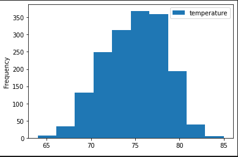
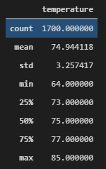
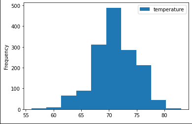
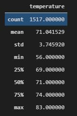

# Surf's Up

## Overview of the Analysis
The purpose of this analysis is to help W. Avy understand temperature patterns in the months of June and December. We assume that summer and winter months are high seasons as the summer holiday and winter holiday occurs during those months. Hence, understanding the temperature patterns during these months can help us make decisions on whether the surf and ice cream shop business is sustainable throughout the year
## Results
### month of June
From our analysis of 1700 temperature measurements throughout the month of June from the year 2010 to 2017, the average temperature during the month of June is 75 degrees Fahrenheit with standard deviation of 3.26 degrees Fahrenheit. The standard deviation is a measurement of how spread out ur measurements are relative to the average/mean.
</br>

</br>
As we see from the histogram plot of the temperature on the month of June from the year 2010 to 2017, the distribution of the histogram is nearly normal. And since the histogram of the measured temperature in June is nearly normal, by the Empirical Rule, we expect 99.7% of our measurements to be within 3 standard deviation of the mean. And as we see, 3 standard deviation is +/-9.78 degrees Fahrenheit. Meaning that 99.7% of the time, on the month of June, our data indicates that the temperature will be between 65.22 to 84.78 degrees Fahrenheit. This finding is also backed up by summary data showing that the min temperature throughout the whole data set is 64 degrees Fahrenheit and the max temperature to be 85 degrees Fahrenheit. The summary statistics for the month of June is as shown below.
</br>

</br>
### month of December

As we see from the distribution of the histrogram for the temperature on the month of December, it is nearly normal with no outliers. We can also apply the emperical rule and say that 99.7% of our observations are within 3 standard deviation of the mean. In the month of December, the mean temperature is 71 degrees Fahrenheit. the standard deviation is 3.75 degrees fahrenheit. This shows that the temperature on the month of December is between 59.75 and 82.25 degrees Fahrenheit. The summary statistics support this finding and is shown below.
</br>

## Summary
We would like to group the stations and see the average temperature of in the stations during the months of June and December. The code for the month of June is the following:
</br>
```python
results = []
results = session.query(Measurement.station, func.avg(Measurement.tobs)).filter(extract('month', Measurement.date) == 6).group_by(Measurement.station).all()
df = pd.DataFrame(results, columns= ['station', 'temperature'])
df.set_index(df['station'], inplace = True)
df = df.sort_index()
df 
```
The code for the month of December is the following:
</br>
```python
results = []
results = session.query(Measurement.station, func.avg(Measurement.tobs)).filter(extract('month', Measurement.date) == 12).group_by(Measurement.station).all()
df = pd.DataFrame(results, columns= ['station', 'temperature'])
df.set_index(df['station'], inplace = True)
df = df.sort_index()
df 
```
